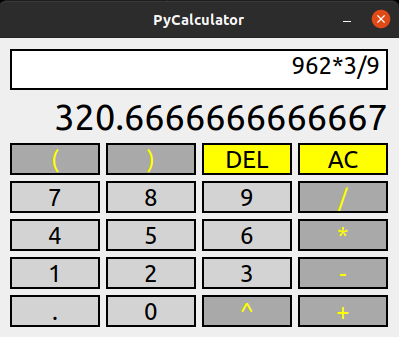

# PyCalculator
This is real time interactive calulator. Implemented using  PyQt5.
* Values are shown automatically in the display as input is being pressed.
* for division by 0, it will show <b>inf</b>.
* for error in calulation like +1+/2, it will display <b>nan</b>.

basic implementation of calculator using PyQt5

src
    GUI.py:  contains PyQt widgets
    LOGIC.py: Logic used for calulation. Refer here: 
        https://umangshrestha09.medium.com/introduction-to-creating-interpreter-using-python-c2a9a6820aa0

executable file compiled using pyinstaller GUI.py 
